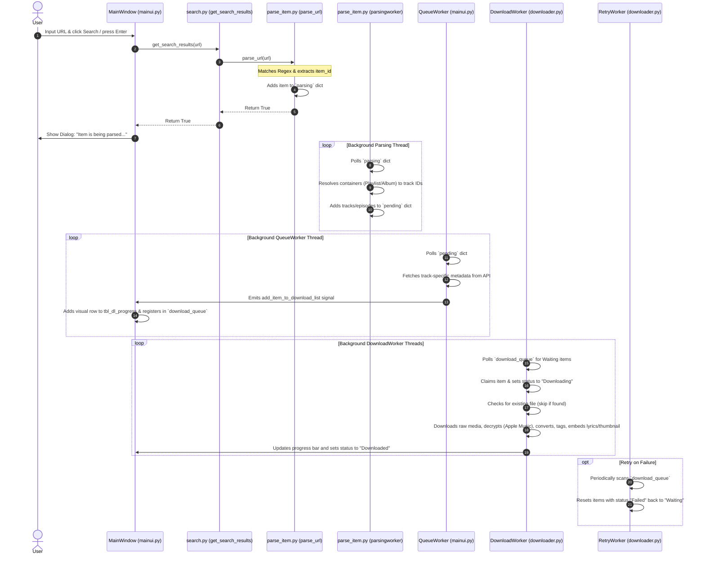

# Search to Download Queue Flow Analysis

This document provides a detailed walkthrough of the execution flow in **OnTheSpot** after a user enters a valid search URL (such as an Apple Music link) in the Search tab, triggers the parsing dialog, and queuing/downloading begins.

---

## 1. Flow Overview & Architecture

The application handles search queries, URL parsing, and downloading asynchronously across several background worker threads to keep the Qt GUI responsive. The flow relies on three key shared global structures (with corresponding threading locks) defined in [runtimedata.py](file:///Volumes/Dev/etal/onthespot-fork/src/onthespot/runtimedata.py):

*   **`parsing` (`parsing_lock`)**: A dictionary holding raw items/URLs that need to be resolved.
*   **`pending` (`pending_lock`)**: A dictionary holding individual resolved media tracks that need metadata fetching.
*   **`download_queue` (`download_queue_lock`)**: A dictionary holding fully resolved tracks that are ready for downloading.

### Flow Diagram



---

## 2. Detailed Execution Steps

### Phase 1: Search Initiation & URL Detection
1. **User Trigger** – The user enters a URL in the search input box of the Search tab and either clicks the search button or presses Enter.
   * **Code Connection**: [mainui.py:L272](file:///Volumes/Dev/etal/onthespot-fork/src/onthespot/qt/mainui.py#L272) and [mainui.py:L289](file:///Volumes/Dev/etal/onthespot-fork/src/onthespot/qt/mainui.py#L289) connect the UI events to `self.fill_search_table`.
2. **`fill_search_table()` Call** – [mainui.py:L890](file:///Volumes/Dev/etal/onthespot-fork/src/onthespot/qt/mainui.py#L890) reads the text and content‑type checkboxes, then calls `get_search_results()`.
3. **URL Identification** – [search.py:L19](file:///Volumes/Dev/etal/onthespot-fork/src/onthespot/search.py#L19) checks if the query starts with `https://` or `http://`.
   * If it matches, it delegates to `parse_url(search_term)` and returns `True`.

### Phase 2: Immediate Regex Parsing & Dialog Popup
1. **URL Regex Matching** – In [parse_item.py:L34](file:///Volumes/Dev/etal/onthespot-fork/src/onthespot/parse_item.py#L34) `parse_url(url)` validates the URL against service‑specific regular expressions (e.g. `APPLE_MUSIC_URL_REGEX`, `SPOTIFY_URL_REGEX`).
2. **Queue into `parsing`** – When a match is found the function extracts `item_id`, `item_type`, `item_service` and stores them under the global `parsing` dict:
   ```python
   with parsing_lock:
       parsing[item_id] = {
           'item_url': url,
           'item_service': item_service,
           'item_type': item_type,
           'item_id': item_id
       }
   ```
3. **UI Feedback Popup** – Because `get_search_results` returned `True`, `fill_search_table()` shows a modal via:
   ```python
   self.show_popup_dialog(self.tr("Item is being parsed and will be added to the download queue shortly."))
   ```
   The dialog then clears the search input.

### Phase 3: Background Parsing & Resolution (`parsingworker`)
1. **Worker Loop** – The thread target `parsingworker()` defined in [parse_item.py:L163](file:///Volumes/Dev/etal/onthespot-fork/src/onthespot/parse_item.py#L163) runs continuously once the app starts.
2. **Processing Containers** – If the item is a container (playlist/album/mix) the worker queries the appropriate service API (e.g. `apple_music_get_playlist_data`, `apple_music_get_album_track_ids`) to retrieve child track IDs, creates a unique `local_id` for each, and pushes them into the global `pending` dict.
3. **Processing Single Tracks** – Single‑track items are added directly to `pending`.

### Phase 4: Metadata Fetching & UI Registration (`QueueWorker`)
1. **Metadata Worker** – The Qt `QueueWorker` thread pool (instantiated in `MainWindow.__init__` and run via `QueueWorker.run()` at [mainui.py:L46](file:///Volumes/Dev/etal/onthespot-fork/src/onthespot/qt/mainui.py#L46)) monitors `pending`.
2. **Fetch Metadata** – For each pending item it obtains a service‑specific token (`get_account_token`) and calls the dynamically‑resolved metadata function:
   ```python
   item_metadata = globals()[f"{item['item_service']}_get_{item['item_type']}_metadata"](token, item['item_id'])
   ```
3. **Signal Emission** – After successful metadata retrieval it emits `add_item_to_download_list.emit(item, item_metadata)`.
4. **UI List Injection** – `MainWindow.add_item_to_download_list` (at [mainui.py:L490](file:///Volumes/Dev/etal/onthespot-fork/src/onthespot/qt/mainui.py#L490)) creates the progress‑bar widget, status label, actions button, and inserts a new row into `tbl_dl_progress`. It also registers the item in the global `download_queue` with status **`Waiting`**.
   * The function respects configuration flags such as `download_lyrics`, `save_album_cover`, `embed_cover`, `raw_media_download`, and `create_m3u_file`. These flags determine whether lyrics are fetched, thumbnails are embedded, files are converted, or an M3U playlist entry is added.

### Phase 5: Processing Downloads (`DownloadWorker`)
1. **Download Thread** – Background `DownloadWorker` threads (defined in [downloader.py:L67](file:///Volumes/Dev/etal/onthespot-fork/src/onthespot/downloader.py#L67)) poll `download_queue`.
2. **Lock & Claim** – A worker selects an item whose `available` flag is `True`, flips it to `False` to avoid duplicate work, and updates `item_status` to **`Downloading`**.
3. **Duplicate‑File Detection** – Before downloading the worker scans the target directory for a file with the same base name (ignoring auxiliary files like `.lrc`, `.ass`, `.srt`, `.vtt`). If found it skips the download, sets status to **`Already Exists`**, and emits a 100 % progress update.
4. **Unplayable / Unavailable Tracks** – If `item_metadata['is_playable']` is `False` the worker marks the item **`Unavailable`** and re‑queues it.
5. **Raw‑Media Mode** – When `config.get('raw_media_download')` is true the worker skips all post‑processing (metadata embedding, thumbnail handling, conversion) and leaves the temporary file as‑is.
6. **Downloading & Decryption**
   * **Spotify** – Uses `librespot` to stream the track, writing directly to a temporary `.ogg` file while emitting progress.
   * **Deezer** – Retrieves a direct URL, downloads encrypted chunks, then decrypts with `calcbfkey`/`decryptfile`.
   * **Apple Music** – Calls `apple_music_get_webplayback_info` to obtain a stream URL, downloads the encrypted `.m4a` file, fetches the decryption key via `apple_music_get_decryption_key`, and runs an FFmpeg command (lines 495‑514) to produce a clear file.
   * **Other Services (Bandcamp, Qobuz, Soundcloud, Tidal, YouTube Music, Crunchyroll, Generic)** – Use `yt_dlp` with service‑specific options, handling subtitles, chapters, and multi‑language audio when applicable.
7. **Post‑Processing** – After a successful download the worker may:
   * Convert audio (`convert_audio_format`) or video (`convert_video_format`).
   * Embed ID3 metadata (`embed_metadata`) and fix MP3 quirks (`fix_mp3_metadata`).
   * Download and embed lyrics (`*_get_lyrics`).
   * Save or embed album art (`set_music_thumbnail`).
   * Append the file to an M3U playlist if `create_m3u_file` is enabled.
8. **Completion** – Status is set to **`Downloaded`**, progress to 100 %, statistics are updated, and the item is re‑added to the queue (so the UI can clean it up later).

### Supporting Workers & Behaviours
- **RetryWorker** – Runs in the background (instantiated when `enable_retry_worker` is true). It periodically scans `download_queue` for items with status **`Failed`** and resets them to **`Waiting`** so they are retried automatically.
- **Cancel‑All** – `MainWindow.cancel_all_downloads()` clears `parsing` and `pending`, and marks any waiting items in `download_queue` as **`Cancelled`**.
- **Pause/Resume** – All workers respect the `self.is_running` flag and can be stopped via their `stop()` method; the UI toggles this flag when the application exits or is minimized to tray.
- **Temporary Download Path** – If `temp_download_path` is set (via the *Download temporary folder* setting), all files are first written there before being moved to the final destination.
- **File‑Name Length Capping** – Before writing a file the worker trims the filename to stay within the OS‑specific maximum path length (260 bytes on Windows, typical limits on Unix).
- **Error Handling** – Throughout `DownloadWorker.run()` every major step is wrapped in `try/except` blocks that log a full traceback, set the item status to **`Failed`**, emit a 0 % progress update, and re‑queue the item for later retry.

---

## 3. Where to Add Tweaks

Depending on what you want to customize, here are the target locations in the codebase:

### A. Tweaking Input URL Validation & Parsing
* **Purpose** – Adjust regular expressions to support new URL schemas, region paths, or sub‑domains.
* **Where to edit** – Regex definitions at the top of [parse_item.py](file:///Volumes/Dev/etal/onthespot-fork/src/onthespot/parse_item.py#L21-L32) and the `parse_url(url)` logic at [parse_item.py:L34](file:///Volumes/Dev/etl/onthespot-fork/src/onthespot/parse_item.py#L34).

### B. Customizing Container Handling (Albums, Playlists, Mixes)
* **Purpose** – Change how playlist items are sorted, filter out tracks (e.g. explicit/live versions), or customize numbering.
* **Where to edit** – The loop inside `parsingworker()` at [parse_item.py:L163](file:///Volumes/Dev/etl/onthespot-fork/src/onthespot/parse_item.py#L163). The branch for `current_type in ["album", "playlist", "mix"]` is around [parse_item.py:L278](file:///Volumes/Dev/etl/onthespot-fork/src/onthespot/parse_item.py#L278).

### C. Adding Hooks Before/After Metadata Resolution
* **Purpose** – Modify metadata attributes (title patterns, year formats, artist joins) before they are sent to the download UI.
* **Where to edit** – Inside the metadata fetch stage of `QueueWorker.run` at [mainui.py:L54-L56](file:///Volumes/Dev/etl/onthespot-fork/src/onthespot/qt/mainui.py#L54-L56). You can add custom processing after `item_metadata` is retrieved but before the signal is emitted.

### D. Intercepting or Modifying the Download & Decryption Process
* **Purpose** – Add extra decryption steps, alter temporary file names, modify FFmpeg flags, or filter download qualities/formats.
* **Where to edit** – The main download logic in `DownloadWorker.run` at [downloader.py:L103](file:///Volumes/Dev/etl/onthespot-fork/src/onthespot/downloader.py#L103). Apple Music decryption commands are specifically at [downloader.py:L495-L514](file:///Volumes/Dev/etl/onthespot-fork/src/onthespot/downloader.py#L495-L514).

*You can also adjust configuration flags in `otsconfig.py` to enable/disable optional behaviours such as lyric download, thumbnail embedding, raw‑media mode, or M3U playlist creation.*
